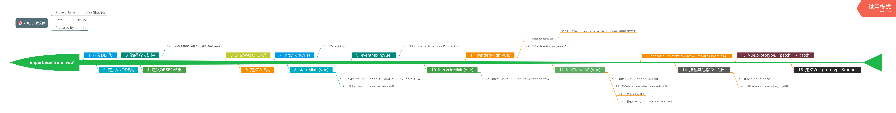

# Vue2源码分析

对Vue2源码进行分析，修炼内功、提炼优秀的设计思想，运用到工作中。

## 前言

* 项目适合对Vue2源码有些了解、对Vue2熟练使用的同学

* 项目贴出来的代码均为精简过的代码，便于理清vue运行的逻辑

* 阅读源码切忌一行一行、一个方法一个方法阅读，需先清楚整体的、重要的逻辑，在对细节部分进行阅读

* 建议打开源码，对比项目进行阅读

* 项目对一些JS的知识不做多余讲解，如`Object.defineProperty`、`Proxy`等

## 概述

主要按照如下方面进行分析

分析过程使用了console，log打在[vue.js](./vue.js)中，如下效果

## 目录

<!-- * [vue整体流程](./doc/整体流程.md) -->

* [vue文件引入过程](./doc/引入过程.md)

* [vue运行机制](./doc/运行机制.md)

* [组件化](./doc/组件化.md)

* [编译](./doc/编译.md)

vue文件引入过程，如下图：

vue运行机制，如下图：

⚠️ `vue.esm.js`为2.5.16，可能和最新版有差异，但整体功能不影响。
