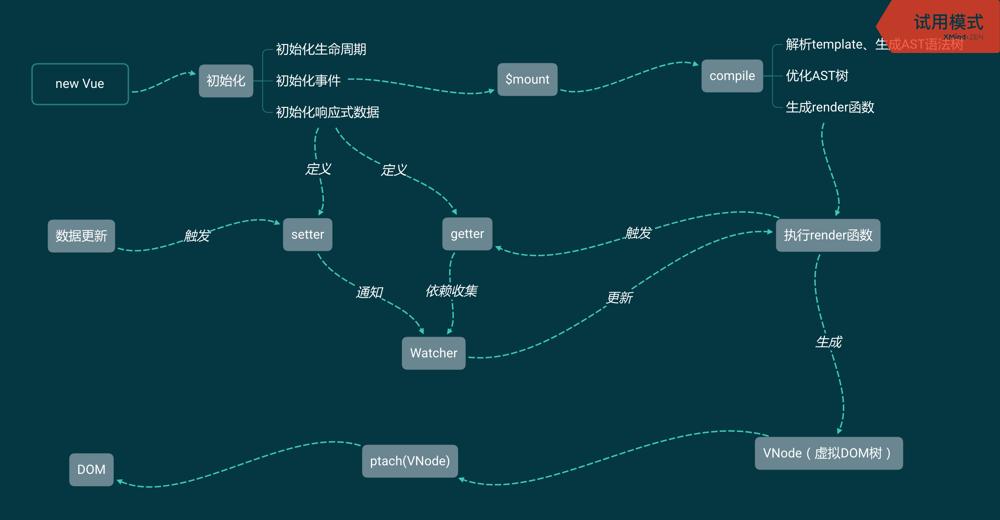

# Vue内部运行机制

开局一张图，从new Vue创建一个Vue实例开始，到DOM出现在浏览器上，vue内部所做的事情

1. [定义响应式数据](./定义响应式数据.md)

2. [挂载](./挂载.md)

3. [生成VNode](./render方法生成VNode.md)
   * [依赖收集](./依赖收集.md)

4. [将VNode转换成真实节点](./将VNode转换成真实节点.md)
   * [派发更新](./派发更新.md)
